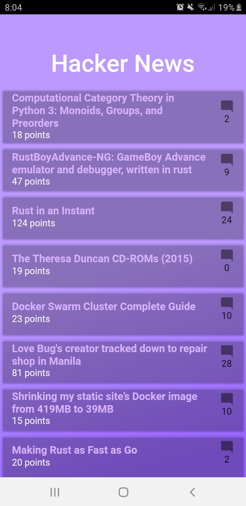

# hacker_news

A new Flutter project.
An app which displays the hottest IT news in ycombinator

## Development environment used
  - Visual Studio Code
  - Android Studio
  
## Some Screenshots

  <h1>Main Page</h1>
   

